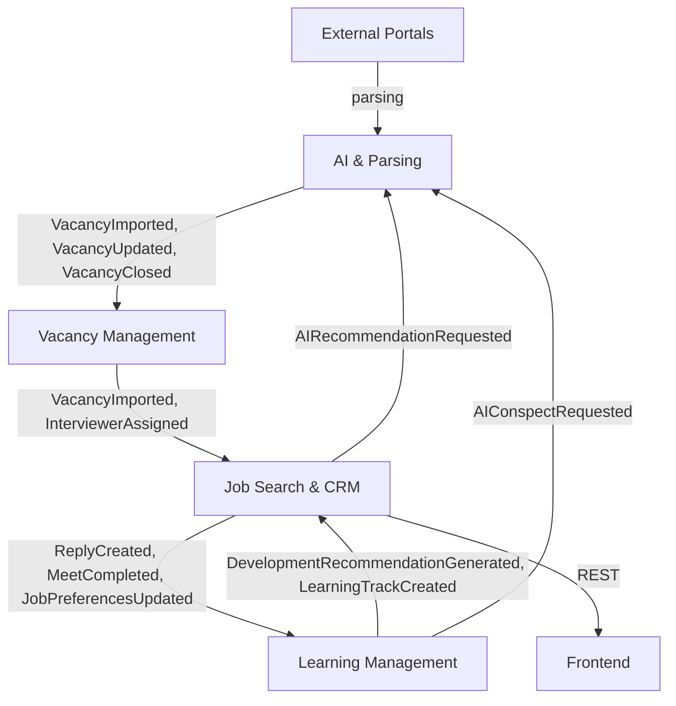

# Context Map

The project defines four main bounded contexts. Their relationships
(upstream/downstream), protocols and link types are described below.

## 1. Bounded Contexts

| Context             | Service                      | Main responsibility                                            |
|---------------------|------------------------------|----------------------------------------------------------------|
| Vacancy Management  | Vacancies (PHP/Laravel)      | Import, store, manage vacancies, employers, interviewers       |
| Job Search & CRM    | ResearcherCrm (PHP/Symfony)  | Job seeker profiles, desired jobs, replies, meetings, messages |
| AI & Parsing        | Parsing&AIConnector (Python) | Portal parsing, AI recommendations, RAG                        |
| Learning Management | KnowledgeCenter (Go)         | Long‑term learning plans, tracks, progress                     |

## 2. Interactions between contexts

### 2.1 AI & Parsing → Vacancy Management

- **Type:** Upstream (Customer‑Supplier)
- **Protocol:** RabbitMQ (async events) + REST (manual trigger)
- **Events:** `VacancyImported`, `VacancyUpdated`, `VacancyClosed`,
  `EmployerImported`
- **Purpose:** Fill the vacancy database with data from external portals.
- **ACL:** Anti‑Corruption Layer inside Parsing&AIConnector transforms external
  formats into Vacancies domain objects.

### 2.2 Vacancy Management → Job Search & CRM

- **Type:** Upstream (Publisher‑Subscriber)
- **Protocol:** RabbitMQ (events)
- **Events:** `VacancyImported`, `VacancyClosed`, `InterviewerAssigned`
- **Purpose:** Provide CRM service with up‑to‑date vacancy and interviewer data
  for replies and meetings.

### 2.3 Job Search & CRM → Learning Management

- **Type:** Upstream (Publisher‑Subscriber)
- **Protocol:** RabbitMQ (events)
- **Events:** `ReplyCreated`, `MeetCompleted`, `MeetCancelled`,
  `JobPreferencesUpdated`
- **Purpose:** Pass information about jobseeker behavior (replies, meetings,
  preferences) to form learning recommendations.

### 2.4 Learning Management → Job Search & CRM

- **Type:** Downstream (Customer‑Supplier)
- **Protocol:** RabbitMQ (events) + REST (learning plan requests)
- **Events:** `DevelopmentRecommendationGenerated`, `LearningTrackCreated`
- **Purpose:** Provide development recommendations and learning plans back to
  CRM for display to the jobseeker.

### 2.5 Job Search & CRM → AI & Parsing

- **Type:** Downstream (Customer‑Supplier)
- **Protocol:** RabbitMQ (command‑requests) + REST (sync requests for demo)
- **Commands / requests:** `AIRecommendationRequested`
- **Purpose:** Get AI recommendations for vacancies, resume, search strategy.

### 2.6 Learning Management → AI & Parsing

- **Type:** Downstream (Customer‑Supplier)
- **Protocol:** RabbitMQ (command‑requests)
- **Commands / requests:** `AIConspectRequested`
- **Purpose:** Generate short summaries on technical topics for inclusion in
  the learning plan.

### 2.7 Frontend → Job Search & CRM and Vacancy Management

- **Type:** Downstream (REST consumer)
- **Protocol:** REST (sync requests)
- **Purpose:** Display data to the user and accept commands (reply, schedule
  meeting).

## 3. Relationship types

| Relationship                    | Description                                                                                                      |
|---------------------------------|------------------------------------------------------------------------------------------------------------------|
| **Customer‑Supplier**           | Upstream context provides data/functionality, downstream consumes. Upstream changes require coordination.        |
| **Publisher‑Subscriber**        | Upstream publishes events, downstream subscribes. Loose coupling, eventual consistency.                          |
| **Conformist**                  | Downstream context fully relies on the upstream model, often due to technical limitations (e.g., portal import). |
| **Anti‑Corruption Layer (ACL)** | Protects downstream from upstream changes (used for integration with external portals and AI providers).         |

## 4. ACL (Anti‑Corruption Layer)

ACL is applied in the following places:

- **Parsing&AIConnector** for external portals (LinkedIn, Djinni) – convert
  HTML/JSON to `ImportedVacancyDTO`.
- **Parsing&AIConnector** for AI providers (OpenAI, Ollama) – unify prompts
  and responses.
- **ResearcherCrm** for Google Calendar – create events, handle OAuth.
- **Authentication module** for Google OAuth2 – token verification, role
  mapping.

## 5. Shared Kernel

**Absent.** Each bounded context has its own domain model. Exception: common
value objects (e.g., `Email`, `Money`) may be duplicated but not shared
between contexts.

## 6. Open Host Service / Published Language

- **Vacancy Management** publishes domain events (`VacancyImported` etc.) in
  AsyncAPI format.
- **Job Search & CRM** publishes events (`ReplyCreated`, `MeetScheduled`) for
  subscribers.
- **Published Language:** JSON event schemas with `event_version` field (see
  Event Versioning Policy).

## 7. Context diagram (text representation)

## 8. Related documents

- [Architecture Overview](architecture-overview.md)
- [Domain Model](domain/domain-model.md)
- [Bounded Contexts](./domain/bounded-contexts)
- [Glossary](glossary.md)
- [C4 diagrams](./c4)
