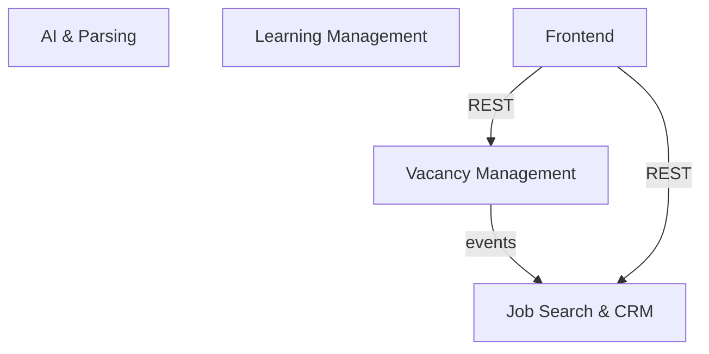

# Context Map

**Status:** accepted
**Date:** 2026-09-27
**Version:** 1.11

> **Related documentation:** [Architecture Overview](architecture-overview.md) |
> [Domain Model](domain/domain-model.md) |
> [Bounded Contexts](./domain/bounded-contexts) | [Glossary](glossary.md) |
> [C4 diagrams](./c4) | [README](./README.md)

The project defines four main bounded contexts. Their relationships
(upstream/downstream), protocols and contracts are described below; aggregate
ownership per context – [Domain Model](domain/domain-model.md) §1.

## 1. Bounded Contexts

| Context             | Service              |
|---------------------|----------------------|
| Vacancy Management  | Vacancies Market     |
| Job Search & CRM    | ResearcherCrm        |
| AI & Parsing        | Parsing&AIConnector  |
| Learning Management | KnowledgeCenter      |

## 2. Interactions between contexts

ACL instances (portals, AI providers, Google Calendar, Google OAuth2) –
[ADR-015](adr/adr-015-acl.md).

### 2.1 Vacancy Management → Job Search & CRM

- **Type:** Upstream (Publisher‑Subscriber) – upstream publishes events,
  downstream subscribes; loose coupling, eventual consistency
- **Protocol:** RabbitMQ (events)
- **Purpose:** Provide CRM service with up‑to‑date vacancy and employer data
  for replies and meetings.

### 2.2 Frontend → Job Search & CRM

- **Type:** Downstream (REST consumer)
- **Protocol:** REST (sync requests)
- **Purpose:** Display job seeker data and accept commands (reply, schedule
  meeting).

### 2.3 Frontend → Vacancy Management

- **Type:** Downstream (REST consumer)
- **Protocol:** REST (sync requests)
- **Purpose:** Search and read public vacancy catalogue data.

## 3. Open Host Service / Published Language

- **Published Language:** JSON event schemas with `event_version` –
  [ADR-012](adr/adr-012-event-versioning.md). The event catalogue is not
  designed yet – [AsyncAPI](asyncapi/events.yaml).

## 4. Context diagram (text representation)

```mermaid
graph TD
    AI[AI & Parsing]
    LM[Learning Management]
    VM[Vacancy Management] -->|events| CRM[Job Search & CRM]
    FE[Frontend] -->|REST| CRM
    FE -->|REST| VM
```

Channel contracts – [AsyncAPI](asyncapi/events.yaml).
