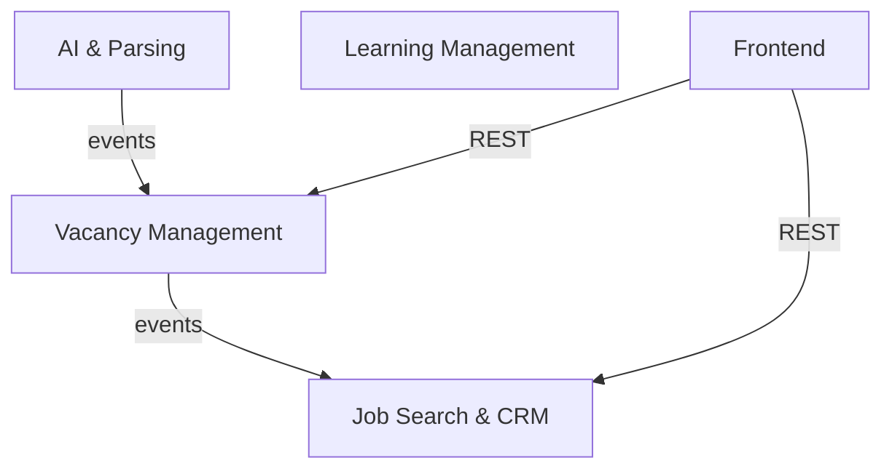

# Context Map

**Status:** accepted
**Date:** 2026-09-30
**Version:** 1.15

> **Related documentation:** [Architecture Overview](architecture-overview.md) |
> [Domain Model](domain/domain-model.md) |
> [Bounded Contexts](./domain/bounded-contexts) | [Glossary](glossary.md) |
> [C4 diagrams](./c4) | [README](./README.md)

The project defines four main bounded contexts. Their relationships
(upstream/downstream), protocols and contracts are described below; aggregate
ownership per context – [Domain Model](domain/domain-model.md) §1.

## 1. Bounded Contexts

| Context             | Service              |
|---------------------|----------------------|
| Vacancy Management  | Vacancies Market     |
| Job Search & CRM    | ResearcherCrm        |
| AI & Parsing        | Parsing&AIConnector  |
| Learning Management | KnowledgeCenter      |

## 2. Interactions between contexts

ACL instances (portals, AI providers, Google Calendar, Google OAuth2) –
[ADR-015](adr/adr-015-acl.md). The kind and transport of every interaction
below follow [ADR-021](adr/adr-021-context-communication.md): query
(synchronous read API), command (asynchronous, with a result event) or event
(asynchronous fact).

### 2.1 Vacancy Management → Job Search & CRM

- **Type:** Upstream (Publisher‑Subscriber, event) – upstream publishes events,
  downstream subscribes; loose coupling, eventual consistency
- **Protocol:** RabbitMQ (events)
- **Purpose:** Provide CRM service with up‑to‑date vacancy and employer data
  for replies and meetings.

### 2.2 Frontend → Job Search & CRM

- **Type:** Downstream (REST consumer, query and command)
- **Protocol:** REST (sync requests)
- **Purpose:** Display job seeker data and accept commands (reply, schedule
  meeting).

### 2.3 Frontend → Vacancy Management

- **Type:** Downstream (REST consumer, query)
- **Protocol:** REST (sync requests)
- **Purpose:** Search and read public vacancy catalogue data.

### 2.4 AI & Parsing → Vacancy Management

- **Type:** Upstream (Publisher‑Subscriber, event) – the parser publishes portal
  update events, Vacancy Management subscribes; eventual consistency
- **Protocol:** RabbitMQ (events)
- **Purpose:** Deliver new and changed employer, vacancy `Source` and
  interviewer records from the three monitoring URLs; Vacancy Management
  normalizes, matches and applies the creates, updates, merges and closures.

### 2.5 Vacancy Management → AI & Parsing

- **Type:** Downstream (REST consumer, query) – the catalogue reads the `Portal`
  registry owned by the parser to resolve the sources it stores by id; a TTL
  cache keeps catalogue reads alive while the owner is unavailable
- **Protocol:** REST (sync query)
- **Purpose:** Resolve `Portal` identities, codes and base URLs.

### 2.6 Vacancy Management → AI & Parsing

- **Type:** Upstream (command) – Vacancy Management asks the parser to apply a
  catalogue change on a portal; the outcome arrives as the event of 2.7
- **Protocol:** RabbitMQ (command)
- **Purpose:** Push changed `Source`, `Employer` and `Interviewer` data to the
  portal (outbound direction of AI & Parsing §3.8).

### 2.7 AI & Parsing → Vacancy Management

- **Type:** Upstream (Publisher‑Subscriber, event) – the parser reports the
  per-item result of a portal update command
- **Protocol:** RabbitMQ (events)
- **Purpose:** Close the loop of 2.6 and let Vacancy Management mark the
  catalogue change as published on the portal.

### 2.8 Job Search & CRM → AI & Parsing

- **Type:** Downstream (REST consumer, query with a computed answer)
- **Protocol:** REST (sync request)
- **Purpose:** Request the AI recommendations and resume or search-strategy
  advice the caller needs in the same request.

### 2.9 AI & Parsing → Job Search & CRM

- **Type:** Upstream (Publisher‑Subscriber, event)
- **Protocol:** RabbitMQ (events)
- **Purpose:** Push generated recommendations to the CRM asynchronously.

### 2.10 Learning Management → AI & Parsing

- **Type:** Downstream (REST consumer, query with a computed answer)
- **Protocol:** REST (sync request)
- **Purpose:** Request a short AI summary for a learning-plan topic.

## 3. Open Host Service / Published Language

- **Published Language:** JSON event schemas with `event_version` –
  [ADR-012](adr/adr-012-event-versioning.md). The event catalogue is not
  designed yet – [AsyncAPI](asyncapi/events.yaml).

## 4. Context diagram (text representation)

```mermaid
graph TD
    AI[AI & Parsing]
    LM[Learning Management]
    VM[Vacancy Management] -->|events| CRM[Job Search & CRM]
    AI -->|events| VM
    FE[Frontend] -->|REST| CRM
    FE -->|REST| VM
```

Channel contracts – [AsyncAPI](asyncapi/events.yaml).
