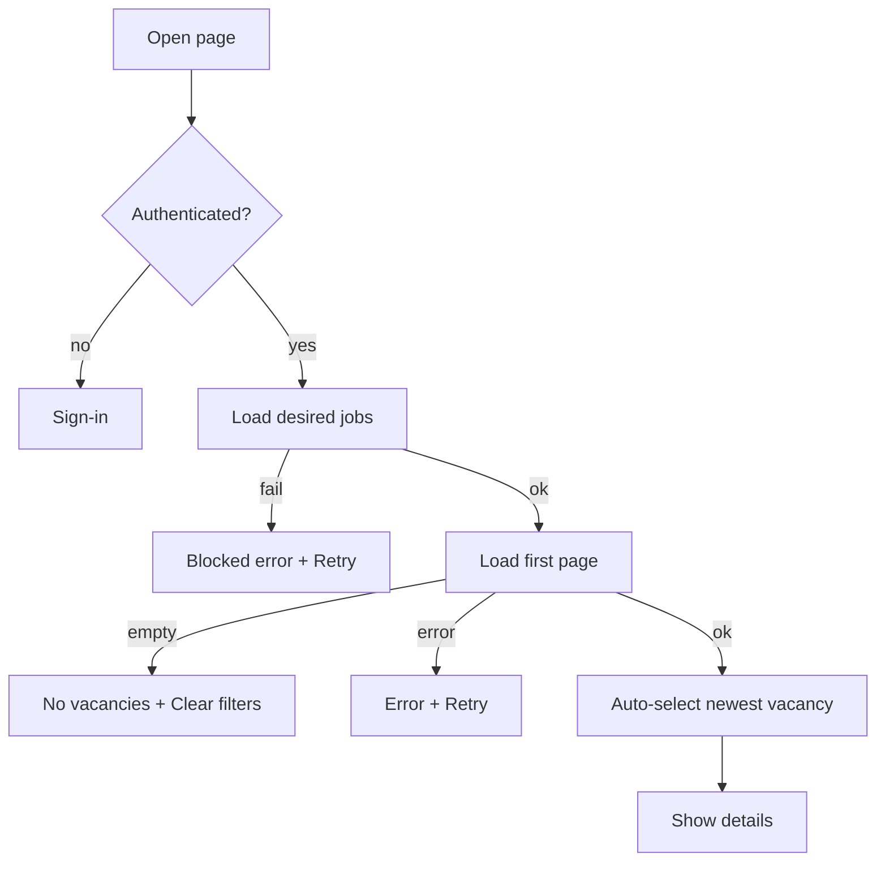
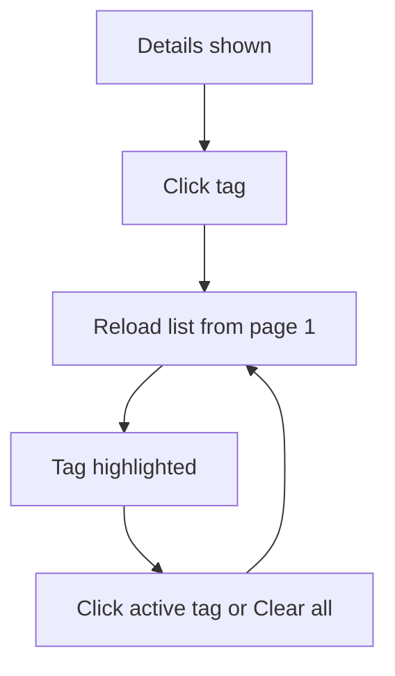
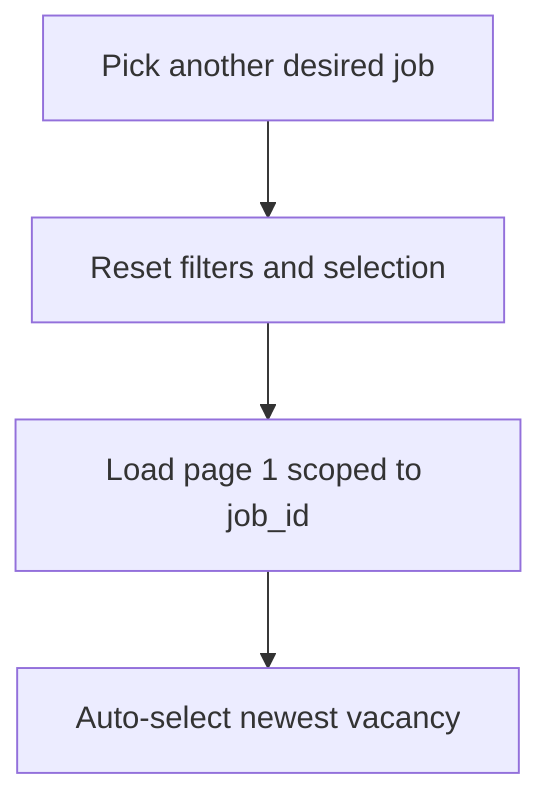
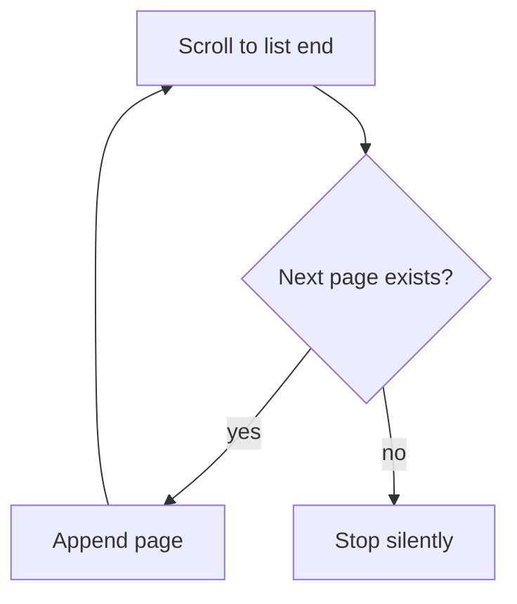
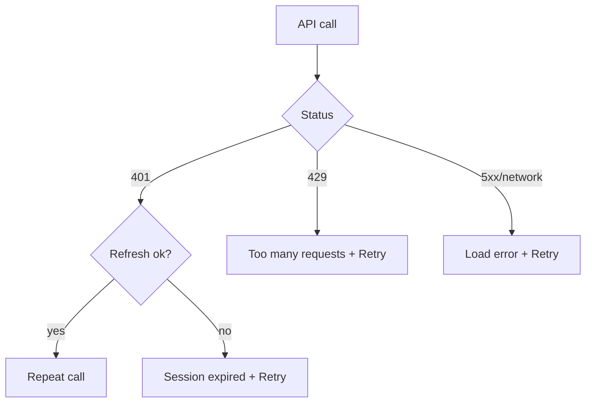

# UI Flows

**Status:** accepted
**Date:** 2026-09-18
**Version:** 1.1

> **Related documentation:** [Glossary](../glossary.md) |
> [UI Pages](./pages.md) |
> [Vacancies Market page](./vacancies-market.md) |
> [ADR-019 Frontend Architecture](../adr/adr-019-frontend-architecture.md)

User flows of the Frontend service, one Mermaid diagram per flow. Per-block
states are defined in the page specifications (for example
[vacancies-market.md](./vacancies-market.md) §5) and are not repeated here.
Audience: frontend engineers, QA and analytics.

## 1. Start And Auto-Selection

- **1.1 Trigger:** opening [Vacancies Market](./vacancies-market.md).
- **1.2 Flow:**

## 2. Filtering

- **2.1** A tag click, a click on an active tag and "Clear all" all reload the
  list from the first page.
- **2.2 Flow:**

## 3. Switching The Desired Job

- **3.1** Switching resets filters, pagination and selection, then auto-selects
  the newest vacancy (6.6).
- **3.2 Flow:**

## 4. Infinite Scroll

- **4.1 Flow:**

## 5. Errors And Session

- **5.1** Error copy and the Retry action are defined in 6.5 of the page
  specification.
- **5.2 Flow:**

## 6. Related Documents

- [UI Pages](./pages.md)
- [Vacancies Market page](./vacancies-market.md)
- [ADR-019 Frontend Architecture](../adr/adr-019-frontend-architecture.md)
- [Glossary](../glossary.md)
