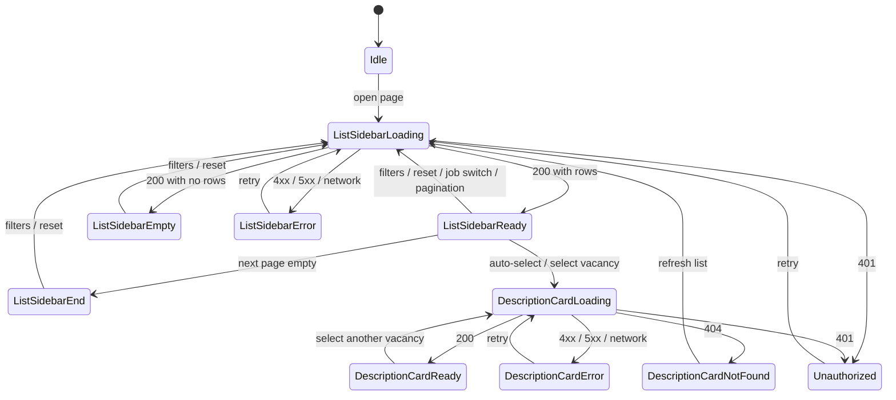

# UI Page Specification: Vacancies Market

**Status:** accepted
**Date:** 2026-09-18
**Version:** 1.32

> **Related documentation:** [Glossary](../glossary.md) |
> [UI Pages](./pages.md) | [UI Flows](./flows.md) |
> [UI Layout](./layout.md) |
> [Architecture Overview](../architecture-overview.md) |
> [Vacancy Management](../domain/bounded-contexts/vacancies-market.md) |
> [Vacancies Market API](../api/vacancies-market/openapi.yaml) |
> [Technical Requirements](../technical-requirements.md)

This document specifies one page of the Frontend service — the Vacancies
Market page: the Desired jobs bar (3.1), the ListVacancy Sidebar (3.4) and the
Vacancy Description Card (3.5) with the company and interviewers blocks
(3.5.3). Audience: frontend engineers, QA and analytics.

## 1. Scope

- **1.1 Context:** [Vacancy Management](../domain/bounded-contexts/vacancies-market.md)
  (Vacancies Market service) — read-only vacancy catalogue for the UI.
- **1.2 Source of truth:** [Vacancies Market API](../api/vacancies-market/openapi.yaml);
  this document does not restate schemas.
- **1.3 Analytics:** deferred; no events are specified for now.

## 2. Page

- **2.1 Route:** `.../vacancies-market`.
- **2.2 Access:** authenticated [Researcher](../glossary.md) only.
- **2.3 Purpose:** find vacancies and inspect one without leaving the page.
- **2.4 Menu:** item "Vacancies Market" (active); the Desired jobs bar (3.1).
- **2.5 Layout:** desktop — two panes (the ListVacancy Sidebar and the Vacancy
  Description Card) that scroll independently; mobile — one column, the
  sidebar → card with a back action.
- **2.6 Header:** the shared page header — see [Layout](./layout.md#2-header).
- **2.7 Accessibility:** WCAG 2.1 AA — keyboard access, visible focus, contrast
  4.5:1, labels/ARIA, `alt` for logo and avatar.
- **2.8 Localisation:** English UI; strings kept as keys for future locales.

## 3. Blocks

- **3.1 Desired jobs** — the researcher's desired jobs (`Job.title`); the
  active job is highlighted and scopes the vacancy list to it (6.6); "Add job"
  link.
- **3.2 Breadcrumbs** — `JobCategory` / `JobSubCategory` / `Parent JobTitle` /
  `JobTitle`, not links.
- **3.3 Selected filters panel** — active filters shown as tags (`workplace`,
  `employment_type`, location, salary); date fields are not displayed. Clicking
  a tag removes it; "Clear all" appears when at least one is active (6.4). The
  location options come from `GET /locations` (see 4.7).
- **3.4 ListVacancy Sidebar:**
  - **3.4.1 Header** — filtering accordion with main and advanced fields;
    vacancy count as small text; no "Based on your desired job:" label.
  - **3.4.2 ListVacancy Card** — `VacancyPreview`: title, employer_title,
    salary, workplace, employment_type; labels are plain text, the card carries
    no filters; the selected card is highlighted.
- **3.5 Vacancy Description Card** — the selected `Vacancy`; empty-selection
  placeholder when no vacancy is selected.
  - **3.5.1 Header** — vacancy title.
  - **3.5.2 Vacancy Tags** — tags in a single row, without columns (workplace,
    employment_type, salary).
  - **3.5.3 About the company and Interviewers** — `title`, `logo_url`,
    `website`, `email`, `phone`, description; `interviewers` (the employer's
    interviewers, array): `full_name`, `position`, `profile_urls`, `avatar_url`
    (embedded in `Vacancy`, moved to the header).
  - **3.5.4 Vacancy Requirements** — `requirements` (array of requirement
    titles), one per row; placed before the Vacancy Descriptions block (3.5.5);
    hidden when empty (7.4).
  - **3.5.5 Vacancy Descriptions** — description by source domain data: per
    source, its `title` and `description`; the block wraps on the source links.

## 4. API Operations

- **4.1 Selected filters panel (3.3) and ListVacancy Sidebar (3.4), Vacancies
  Market:** `POST /vacancies` — get vacancies by `jobIds`.
- **4.2 Vacancy Description Card (3.5), Vacancies Market:** `GET /vacancy/{id}`
  — get vacancy details.
- **4.3 Desired jobs (3.1), ResearcherCrm:** `GET /researchers/{id}` — receive
  the researcher's `jobIds`.
- **4.4 Job catalogue (3.1), Vacancies Market:** `POST /jobs` with the job ids
  from 4.3 — resolves the `Job` records (`title`, `category`, `sub_category`,
  `parent_job_title`).
- **4.5 Auth:** OAuth2/JWT bearer (`BearerAuth`); the access token is kept in
  memory and the refresh token in an httpOnly cookie — on `401` the client
  refreshes once, then shows the error state (6.5); `Correlation-ID` on every
  call.
- **4.6 Pagination (3.4):** `page` / `per_page`, max 100 (default 20).
- **4.7 Selected filters panel (3.3), Vacancies Market:** `GET /locations` —
  location dictionary for the filter selects.

## 5. States

## 6. Behaviour

- **6.1** State lives in memory only (not in the URL) and resets on reload.
- **6.2** On load the first (newest) vacancy is selected in the ListVacancy Card
  (3.4.2) automatically and its Vacancy Description Card (3.5) is fetched.
- **6.3** Selection in the ListVacancy Card (3.4.2) by click/tap or keyboard
  (arrows move, Enter/Space confirm). On mobile the list stays in front; the
  Vacancy Description Card (3.5) opens on tap, scrolled to the top, and back
  returns to the list at the same position.
- **6.4** In the Selected filters panel (3.3), clicking a tag filters the list,
  clicking an active tag removes it, and a "Clear all" action appears when at
  least one tag is active. Any filter change reloads from the first page and
  scrolls to the top; active tags are highlighted; several tags combine.
- **6.5** Errors show a per-code message (`401` session expired, `429` too many
  requests, `5xx`/network load error) with a retry action.
- **6.6** Switching the desired job (3.1) reloads the list scoped to that job
  (`job_id`) from the first page; filters, pagination and the selected vacancy
  reset, and the newest vacancy is auto-selected (6.2).

## 7. Edge Cases

- **7.1** Selected vacancy returns 404: the Vacancy Description Card (3.5)
  shows a "vacancy unavailable" placeholder with a "Refresh list" action.
- **7.2** An empty next page stops pagination silently (4.6).
- **7.3** Closed vacancies stay in the ListVacancy Card (3.4.2) and the Vacancy
  Description Card (3.5), dimmed and without a badge; a missing salary shows a
  "salary not specified" placeholder.
- **7.4** The Vacancy Description Card (3.5) hides empty sub-blocks (Vacancy
  Requirements 3.5.4, Vacancy Descriptions 3.5.5); while it loads it shows a
  skeleton, and the ListVacancy Sidebar stays interactive.
- **7.5** Empty list: "no vacancies found" plus "Clear filters" when at least
  one tag is active.
- **7.6** Desired jobs (3.1) fail: the page is blocked with an error and a
  Retry action; the list is not loaded.
