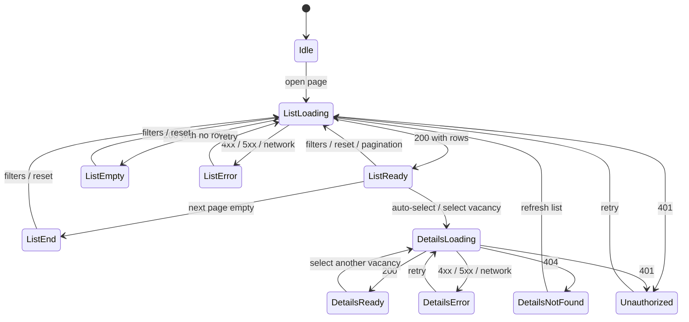

# UI Page Specification: Vacancies Market

**Status:** accepted
**Date:** 2026-09-18
**Version:** 1.10

> **Related documentation:** [Glossary](../glossary.md) |
> [UI Pages](./pages.md) | [UI Flows](./flows.md) |
> [Architecture Overview](../architecture-overview.md) |
> [Vacancy Management](../domain/bounded-contexts/vacancies-market.md) |
> [Vacancies Market API](../api/vacancies-market/openapi.yaml) |
> [Technical Requirements](../technical-requirements.md)

This document specifies one page of the Frontend service — the Vacancies
Market page: the vacancy list plus the details, employer and interviewer
blocks. Audience: frontend engineers, QA and analytics.

## 1. Scope

- **1.1 Context:** [Vacancy Management](../domain/bounded-contexts/vacancies-market.md)
  (Vacancies Market service) — read-only vacancy catalogue for the UI.
- **1.2 Source of truth:** [Vacancies Market API](../api/vacancies-market/openapi.yaml);
  this document does not restate schemas.
- **1.3 Analytics:** deferred; no events are specified for now.

## 2. Page

- **2.1 Route:** `.../vacancies-market`.
- **2.2 Access:** authenticated [Researcher](../glossary.md) only.
- **2.3 Purpose:** find vacancies and inspect one without leaving the page.
- **2.4 Menu:** item "Vacancies Market" (active); breadcrumbs "Vacancies
  Market" → vacancy title.
- **2.5 Layout:** desktop — two panes (list, details) that scroll
  independently; mobile — one column, list → details with a back action.
- **2.6 Header:** logo (links to the home page); desired-jobs bar (`Job.title`)
  with the active job highlighted and an "Add job" link; switching the job
  changes the list context.
- **2.7 Accessibility:** WCAG 2.1 AA — keyboard access, visible focus, contrast
  4.5:1, labels/ARIA, `alt` for logo and avatar.
- **2.8 Localisation:** English UI; strings kept as keys for future locales.

## 3. Blocks

- **3.1 Filters:** clickable tags on the cards and in the details block —
  `workplace`, `employment_type`, `country`, `city`, salary; clicking filters
  the list by that value (e.g. `workplace=remote`). `posted_at` is filtered by
  a date range (`posted_from`/`posted_to`) instead of a tag.
- **3.2 Results list** — `VacancyPreview`: title, employer_title, salary,
  workplace, employment_type, posted_at, country, city; the selected card is
  highlighted.
- **3.3 Sorting and pagination:** fixed `posted_at` descending (newest first);
  infinite scroll appends the next page.
- **3.4 Details block** — `Vacancy`: title, workplace, employment_type,
  posted_at, country, city, salary, description, requirements;
  empty-selection placeholder.
- **3.5 Employer block** — `title`, `logo_url`, `website`, `email`, `phone`,
  description (embedded in `Vacancy`).
- **3.6 Interviewer block** — `full_name`, `position`, `profile_urls`,
  `avatar_url` (embedded in `Vacancy`).

## 4. API Operations

- **4.1 List and filters (3.1-3.3):** `POST /vacancies`.
- **4.2 Details (3.4):** `GET /vacancy/{id}`.
- **4.3 Auth:** OAuth2/JWT bearer (`BearerAuth`); the access token is kept in
  memory and the refresh token in an httpOnly cookie — on `401` the client
  refreshes once, then shows the error state (6.5); `Correlation-ID` on every
  call.
- **4.4 Pagination:** `page` / `per_page`, max 100 (default 20).

## 5. States

## 6. Behaviour

- **6.1** State lives in memory only (not in the URL) and resets on reload.
- **6.2** On load the first (newest) vacancy is selected automatically and its
  details are fetched.
- **6.3** Selection by click/tap or keyboard (arrows move, Enter/Space confirm).
  On mobile the list stays in front; details open on tap, scrolled to the top,
  and back returns to the list at the same position.
- **6.4** Clicking a tag filters the list, clicking an active tag removes it, and
  a "Clear all" action appears when at least one tag is active. Any filter
  change reloads from the first page and scrolls to the top; active tags are
  highlighted; several tags combine.
- **6.5** Errors show a per-code message (`401` session expired, `429` too many
  requests, `5xx`/network load error) with a retry action.
- **6.6** Switching the desired job reloads the list scoped to that job
  (`job_id`) from the first page; filters, pagination and the selected vacancy
  reset, and the newest vacancy is auto-selected (6.2).

## 7. Edge Cases

- **7.1** Selected vacancy returns 404: the details block shows a "vacancy
  unavailable" placeholder with a "Refresh list" action.
- **7.2** An empty next page stops pagination silently.
- **7.3** Closed vacancies stay in the list and details, dimmed and without a
  badge; a missing salary shows a "salary not specified" placeholder.
- **7.4** The details block hides empty sections (description, requirements);
  while details load it shows a skeleton, and the list stays interactive.
- **7.5** Empty list: "no vacancies found" plus "Clear filters" when at least
  one tag is active.
- **7.6** Desired-jobs bar fails: the page is blocked with an error and a Retry
  action; the list is not loaded.
